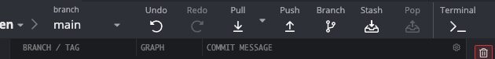

# learn-gitKraken

GitKraken 是一個圖形化介面的 Git 工具

## 0. 安裝 GitKraken

#### 1. 點擊下方的官方首頁下載安裝包 & 安裝
[官方首頁: https://www.gitkraken.com](https://www.gitkraken.com)

## 1. GitKraken 基本設定 及 與 GitHub 連結

#### 首次開啟 GitKraken 軟體，需要進行登入驗證
- 1. 選擇 >> GitHub ( 貓貓Logo )
- 2. 點擊 >> Sign in with GitHub

#### 此時會彈出網頁視窗要求登入 GitHub 並要求權限
- 1. 如果瀏覽器有保存 GitHub 帳號密碼，則會詢問開啟 GitKraken 軟體，此時許可即可。
- 2. 首次登入時，在 GitHub 中需要同意 GitKraken 取用權限。
- 3. 如果 GitKraken 需要 Token，請點擊網頁下方的 Copy Token，提供給 GitKraken 軟體。

#### 成功連結 GitHub 後，首次使用會要求設定基本資料
- 1. 設定 大頭貼
- 2. 其他一律預設即可

## 2. 創建倉庫

#### 開始創建及連結倉庫
- 1. 在軟體的左上角有一個文件夾的 Logo，點擊後打開

- 2. ( 說明 ) 此時會看到左中右三大區塊

        |區塊 |欄位        |說明
        |:--:|:----------:|:-----------------------
        |左側 |Open       |打開現有倉庫
        |    |Clone      |遠端克隆倉庫到本地
        |    |Init       |在本地初始化一個新倉庫
        |--- |-----------|---------------------------------------
        |中間 |Local Only |只在本地的倉庫操作
        |    |其他        |雲端倉庫
        |--- |-----------|---------------------------------------
        |右側 |資料填寫    |根據左側菜單的目的，而需要填寫的資料

- 3. 由於我們是從零開始，所以左側選擇 Init，中間選擇 GitHub.com

        |欄位                 |檢查  |說明
        |:------------------:|:----:|:----
        |Account             |必選   |選擇自己的 GitHub 帳戶，作為遠端倉庫
        |Name                |必填   |該倉庫的名稱
        |Description         |      |關於該倉庫的描述
        |Access              |必選   |該倉庫的可視者，Public 為公開；Private 為私有僅自己可見
        |Clone after init    |勾選   |創建後克隆到本地並且初始化
        |Where to clone to   |必填   |選擇倉庫在本地電腦的位置
        |Full path           |      |此項可以用來確認路徑及倉庫名稱是否正確
        |Default branch name |必填   |預設分支請填入 main
        |.gitignore          |      |此項用以忽略部分文件不進行倉庫同步
        |License             |      |此項用以版權聲明

- 4. 以上資料都填妥後，點擊右下角綠色的 Create 按鈕以創建倉庫

#### 創建成功
- 1. 用戶介面會立刻跳轉到版本控制紀錄首頁
- 2. 左下角會彈出一個水藍色的提醒事項，點擊帶有 open 可以立刻前往 GitHub 中查看倉庫。也可以自行前往 GitHub 中查看。

#### 在 gitHub 中查看倉庫
- 登入 GitHub 頁面的右上角的個人 Logo處：
    - 1. 點擊 >> 下選菜單
    - 2. 選擇 >> Your repositories ( 意為：我的倉庫 )

- 成功後會來到個人倉庫頁面

- 若前面倉庫創建成功，此處會多出一個先前創建的倉庫名稱

- 點擊倉庫名稱可以進入該倉庫查看，該倉庫中的文件、資料必然與本地倉庫一致

## 3. 本地倉庫上傳到雲端倉庫進行同步

#### 3.1 使用 VSCode 打開本地倉庫文件夾 & 添加文件
滑鼠停留在標題欄位中，會顯示出下面樣式的 Logo，點擊後會自動生成一個文件

輸入一個測試文件的名稱，後綴為 .txt 然後 Enter 即可

文件名稱顏色：
- 綠色：新添加的文件
- 黃色：文件內容有修改
- 白色：沒有變化
- 紅色：該文件已被刪除

因此，如果上述都成功後，會產生一個綠色名稱的測試文件.txt

#### 3.2 GitKraken 介面說明
切換到 GitKraken 軟體中

- 左側：(Branch) 分支及 (Tag) 標籤欄
- 中間：分支視圖
    - 以圓形圖案為中心，一個圓形圖案為一個變更紀錄
    - 圓形圖案的右側是，變更報告
    - 圓形圖案的左側是，當前所處的版本位置

- 右側：文件變更預覽及報告
    - 上方是 (Unstaged & Staged Files) 文件變更預覽
    - 下方是 (Commit Message) 變化報告

- 上方：Git 操作指令
    - Pull >> 將雲端倉庫同步到本地 (下載)
    - Push >> 將本地倉庫同步到雲端 (上傳)

#### 3.2
在上傳到雲端倉庫前，我們需要做完以下幾件事才能夠上傳成功：
0. 在此之前，我們需要先了解 Unstaged Files 及 Staged Files 的關係
    - Unstaged Files：所有變更都會暫存於此
    - Staged Files：抽選並標記變更
        - 抽選出來的變更是此次 Commit Message 變更報告所指的內容。也就是說，變更報告中提到的變更都是 Staged Files 中的變化；而 Unstaged Files 則是整個倉庫的變動。
        - 一種情況是：有一些變動可能當前不希望同步到雲端，因此可以無需抽選出來。
        - 另一種情況：把相關的變更分批填寫多筆報告，易於日後查看幾維護。

1. 現在開始進行變更報告。在右側，有一個名為 Stage all changes 的綠色按鈕，意為將所有變化文件抽選出來到 Staged Files 中。點擊後也會看到 Unstaged Files 中的文件全部都到了 Staged Files 中。
    - 為了易於理解，我們此處直接點擊 Stage all changes 抽選所有變更。

    - 所有文件變更紀錄：
    

    - 所有變更文件抽選出來後：
    

2. 最下方的 Commit Message 變更報告有兩個欄位

    |欄位         |說明
    |:----------:|:----
    |Summary     |概述此次變更的內容
    |Description |較為詳細的描述此次變更的內容

    - 變更報告規格

    Summary 有一套輸入規則，如下方例子：

    - 例 > Add : 說明書
    - 例 > Fix : 說明書格式顯示錯誤
    - 例 > Modify : 說明書內容異動

    前置標籤對照表
    |標籤         |說明
    |:----------:|:----
    |Add         |添加了新功能、內容等
    |Modify      |修改了某項內容
    |Fix         |修復了某項功能
    |Remove      |移除了某項功能
    |Optimize    |優化了某項功能
    |Up          |與前一筆變更報告一直，屬於遺漏了的補充

    Summary 的字數長度限制：
    - Description 內容則因人而異，如果可以簡單透過 Summary 概述則可以不需要填寫；如果難以簡短表達則採需要透過描述欄位來進一步講解此次變更。

3. 填寫變化報告

    由於前面我們只添加了一個 .txt 文件到倉庫中，因此 Summary 可以按照上方所述:
    - Add : test.txt

    而 Description 可以忽略；

    填寫完畢後，在最下方有一個名為 Type a message to commit 的按鈕，點擊該按鈕。

    - 中間的分支視圖的當前變更紀錄會由虛線圓圈變成一個 Logo
    

    - 改變為紀錄：右側則顯示剛剛輸入的變更報告 Summary
    

    - Commit 成功後，會發現，電腦小圖標 和 GitHub 的圖標分開了
    
    電腦圖標：本地倉庫的紀錄
    GitHub圖標：雲端倉庫的紀錄
    
    這意味著，我們本地的紀錄比雲端紀錄來得更新版，事情也確實如此，因為剛剛我們填寫的變更報告是指本地的變化而非雲端，因此才出現本地與雲端不同步的情況。

    接下來就是將本地的變更推送到雲端，讓雲端倉庫一併更新先前修改的內容。此時只需要點擊
    - 點擊 Push，就是將本地紀錄推送到雲端
    

    如果推送成功，左下角會彈出水藍色窗口嗎，此時就能到 GitHub 上查看了；
    如果推送失敗，左下角會彈出紅色窗口，並附上失敗原因。

    常見的失敗原因：
    - 雲端紀錄有變化，此時需要先把雲端紀錄 Pull 到本地，才能夠 Push 到雲端。

